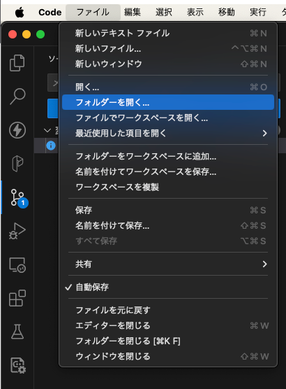
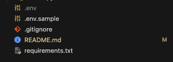

受講生用のリポジトリなので、このリポジトリは基本 README.md 以外いじらない。

- https://github.com/Chainlit/chainlit のリポジトリをみてみて、chainlit のを使って対話方のチャットボットを作ってみましょう。

- 具体な内容は [wiki](https://github.com/matsuoinstitute/chatbot-demo/wiki) に記載、ここでは、コードを書くために必要な基本的な手順を記載します。

# 1. Docker Desktop のインストール

Docker は、アプリケーションをコンテナという単位でパッケージ化し、環境に依存せずに実行できるようにする技術です。コンテナは、アプリケーションの実行に必要なコード、ライブラリ、設定ファイルなどを含んでおり、どの環境でも同じように動作します。これにより、「開発環境では動いたのに、本番環境では動かない」といった問題を解決できます。

Docker Desktop は、Windows や Mac などのデスクトップ環境で Docker を簡単に使用できるようにするアプリケーションです。Docker Desktop によって、GUI を通した Docker のセットアップが可能になり、スムーズに Docker エコシステムへの参入が可能になります。

> 参考リンク
>
> - [【入門】Docker Desktop とは何ができるの？インストールと使い方](https://www.kagoya.jp/howto/cloud/container/dockerdesktop/)
> - [Windows 11 に Docker Desktop を入れる手順（令和 5 年最新版）](https://qiita.com/zembutsu/items/a98f6f25ef47c04893b3)
> - [Docker for Mac をインストールする方法は？導入手順や使い方を初心者向けに解説](https://www.kagoya.jp/howto/cloud/container/dockerformac/)

# 2. VSCode の準備

## 2.1. VSCode のインストール

Visual Studio Code（VSCode）は、Microsoft が開発した無料でオープンソースのコードエディタです。軽量でありながら強力な機能を備えており、Windows、Mac、Linux の各プラットフォームに対応しています。プログラミング言語やフレームワークに依存しない汎用性の高さ、開発を円滑にする拡張機能や git 連携により、世界中の開発者に広く利用されています。

> 参考記事
>
> - [Visual Studio Code のダウンロードとインストール | javadrive](https://www.javadrive.jp/vscode/install/index1.html)
> - [MacOS で Visual Studio Code をインストールする手順 | Qiita](https://qiita.com/watamura/items/51c70fbb848e5f956fd6)

## 2.2. devcontainer のインストール・使い方

DevContainer は、VSCode の Remote - Containers 拡張機能を通じて、Docker コンテナ内で開発環境を構築し、利用するための機能です。

DevContainer の利用により、開発環境のセットアップ時間が大幅に短縮されます。また、プロジェクトに参加する全員が同じ開発環境を共有するため、環境差異によるトラブルを防ぐことができます。さらに、Docker コンテナを使用するため、開発環境を簡単に再現、共有、移行することが可能となります。これにより、環境構築の複雑さを意識することなく、コーディングに集中することができます。

DevContainer は、VSCode の拡張機能（2x2 のマスで右上だけ浮いているようなアイコン）からインストールできます

> 

> 参考記事
>
> - [VSCode Dev Containers でこれからの開発環境構築](https://cloudsmith.co.jp/blog/virtualhost/docker/2023/05/2381142.html)
> - [VS Code+DevContainer+Docker で最強 Python 開発環境](https://zenn.dev/aidemy/articles/vscode-env-python)

# 3. 本課題でコードを書くまで

### 1. 今見ているページをローカルの適当な場所に git clone する

```sh
git clone https://github.com/matsuoinstitute/chatbot-demo
```

### 2. VSCode にて、clone してできた chatbot-demo フォルダを選択

> 

### 3. 右下に出てくる、「コンテナを再度開く」ボタンを押す

> ボタンが出てこない場合は、コマンドパレット（⌘+p）で「>dev」と打てばコンテナを開くボタンが出現します

> 

### 4. env ファイルの設定

env.sample をコピー＆ペーストして、作成できたファイルを「.env」という名前に変更

> 以下のような構造になっていれば OK です

> 

.env ファイルには、「sk-」から始まる自分の OpenAI API キーを設定します。

---

これで、コードを書ける環境ができたはずです。LLM アプリの開発を始めましょう！

まずは src 直下に移動して、demo.py を動かしてみましょう！
